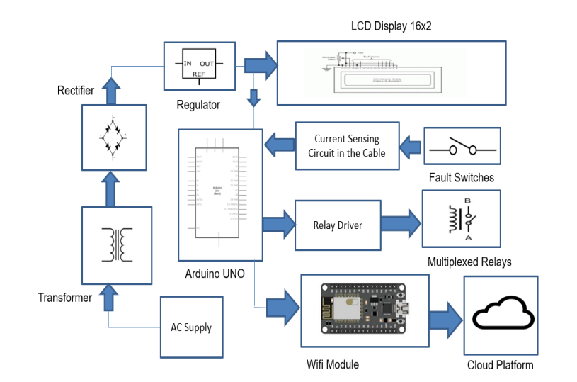
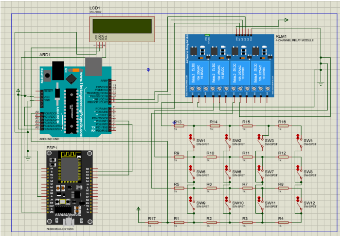
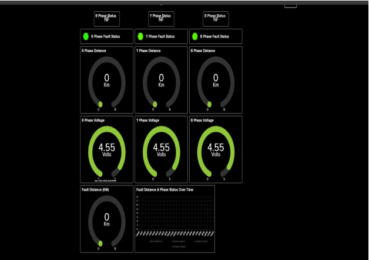
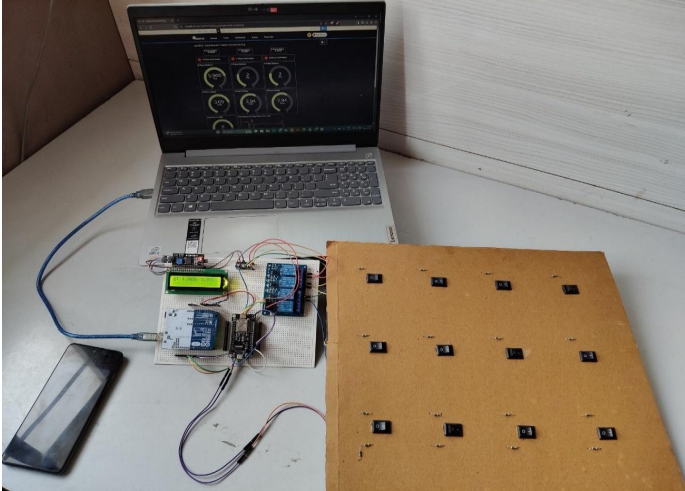

# ⚡ IoT-Based Underground Cable Fault Detection System

A real-time system that detects and isolates underground cable faults phase-wise (R, Y, B) using Arduino, ESP8266, and cloud integration with Adafruit IO. The system calculates the fault distance based on voltage drop and displays the result on an LCD and a web dashboard.

---

## 📌 Table of Contents
- [Project Overview](#project-overview)
- [Features](#features)
- [Hardware Used](#hardware-used)
- [Block Diagram](#block-diagram)
- [Circuit Diagram](#circuit-diagram)
- [Working](#working)
- [Cloud Dashboard (Adafruit IO)](#cloud-dashboard-adafruit-io)
- [Skills Demonstrated](#skills-demonstrated)
- [Demo Images](#demo-images)
- [How to Use](#how-to-use)
- [Contributors](#contributors)

---

## 🚀 Project Overview

This system automatically detects the presence of a fault in underground 3-phase cables and calculates the fault distance using voltage drop logic. It helps in efficient maintenance and quick response to power failures.

📲 **Live data is sent to the cloud using ESP8266 (NodeMCU)**  
📟 **Faults and distances are displayed on an LCD screen and Adafruit IO**

---

## ✨ Features
- Fault detection in R, Y, B phases
- Fault distance calculation (2, 4, 6, 8 km)
- LCD and Adafruit IO display
- Real-time monitoring via Wi-Fi
- Phase isolation using relays

---

## 🔧 Hardware Used
- Arduino Uno
- ESP8266 (30-pin NodeMCU)
- 4-Channel Relay Module
- I2C 16x2 LCD
- Resistors and switches for simulation
- Breadboard, jumper wires, power supply

---

## 🧠 Block Diagram

---

## 🛠 Circuit Diagram

---

## ⚙️ Working

1. Fault is simulated using switches and voltage divider resistors.
2. Arduino reads voltage on A0 pin and calculates fault distance.
3. Relays are triggered to isolate faulty phase.
4. Data is sent via SoftwareSerial to ESP8266.
5. ESP8266 publishes data to Adafruit IO (MQTT).
6. LCD displays the phase-wise status and distance.

---

## 🌐 Cloud Dashboard (Adafruit IO)

- R/Y/B Phase Status
- Fault Distance in Km
- Real-time Voltage
- History Graph (optional)

---

## 💡 Skills Demonstrated
- Embedded C/C++ (Arduino, ESP8266)
- Serial Communication (UART/SoftwareSerial)
- Cloud Integration via MQTT
- Circuit Design and Simulation (Proteus/Fritzing)
- IoT Dashboard (Adafruit IO)

---

## 📸 Demo Images

| Final Prototype | Dashboard |
|-----------------|-----------|
|  |  |

---

## 🧪 How to Use
1. Upload the Arduino sketch to the Uno
2. Upload the ESP8266 sketch via Arduino IDE
3. Configure your Wi-Fi SSID and Adafruit IO credentials in code
4. Power the system and monitor output on LCD and Adafruit IO

---

## 👨‍💻 Contributors
- **Jay Dukare**  
Electronics & Telecommunication Engineering  
Modern College of Engineering, Pune  
📧 [LinkedIn](https://www.linkedin.com/in/jaydukare) | 📡 IoT | ⚙️ Embedded Systems

---

